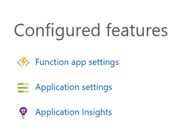

# Lab 1 - Azure Functions 101

In this lab, you will make your first steps in exploring Azure Functions from the Azure portal. You are going to spend some time discovering various aspects from the 

Goals for this lab: 
- [Create a Function App](#1)
- [Create your first Azure Function](#2)
- [Run your Azure Function](#3)
- [Explore the anatomy of a Function](#4)
- [Discover settings and configuration of a Function App](#5)

## <a name="1"></a>1. Create a Function App in Azure

This part requires you have an active Azure subscription. If you do not, you can create a trial account at [Microsoft Azure](https://azure.microsoft.com/en-us/free/). It will require access to a credit card, even though it will not be charged.

Open the [Azure portal](https://portal.azure.com) and create a new Resource Group. Pick any name, such as ```FunctionsWorkshop2018```, and a region of your preference.

Add a new resource of type ```Function App``` in the resource group you just made 

In the details of the Create blade choose the following:
- **Name**: Something globally unique
- **Resource group**: Select the existing one you created.
- **Hosting plan**: Consumption
- **Location**: Preferably same as the location of the resource group.
- **Storage**: New, and give it a proper name, e.g. your function name with a ```storage``` postfix. Make sure the name is all lowercase and not longer than 24 characters.
- **Application Insights**: On, and in the same location as the resource group.

Click Create to start the deployment of the resources.

> What resources have been created in your resource group? 
>
> Make a (mental) note of the names. 

## <a name="2"></a>2. Create your first Azure Function 

Open the newly blade for the created Function App in the portal. 
One the left menu select Functions and notice that there are no functions yet. At the top of the list click the ```New function``` next to the plus sign. Alternatively, you can also choose the plus sign next to the Function menu item on the left.

You might encounter this window:


Simply choose ```Custom function``` from the bottom half and continue.

From all templates pick the ```HTTP trigger with parameters```. You can experiment with other function types later. 
Set the language to C# and Authorization level to ```Function```. Finally, click Create.

> Take a moment to look at the signature of the created function. 
>
> What do you notice? What type of file is used?

## <a name="3"></a>3. Run your first Azure Function 

Expand the Tab to the right of the function ```run.csx```. Select GET as the HTTP method and fill in a value in the textbox for the ```name``` parameter.  
Next, click the Run button and see what happens. 
Also, try it without any value for the ```name``` parameter.

Another way of running your HTTP function is by using the link from the function's URL. Find this URL by clicking on the ```</> Get function URL``` link next to the Run button. Copy the link and paste it into your browser's address bar. Navigate to the URL. 

> Does it work? 
>
> What do you need to do execute the function successfully?

## <a name="4"></a>4. Explore the anatomy of a Function

Now that you have your first function, let's spend some time looking around the Function App. 

First, select the ```View files``` tab to the right of the Editor window. Notice how it lists the ```run.csx``` file and also a ```function.json``` file. Examine the contents of the latter file by clicking it, so it opens in the editor. The JSON file contains important metadata for the function. It is required for the runtime to be able to execute the function at all. Remember this file.

Next, select ```Integrate``` in the left menu of the Functions. Examine the dialog that appears.

> Do you recognize the elements in this dialog? Where did you just see these items?

Proceed to have a look at the other menu items of ```Manage``` and ```Monitor``` underneath ```Integrate```.  

> What can you do at each of these two items?

From the Monitor tab, it is also interesting to follow the ```Run in Application Insights``` link at the top.

## <a name="5"></a>5. Discover settings and configuration of a Function App

The final part of this lab will allow you to freely explore and discover settings and configuration of a Function App. 

Here are some interesting areas to look into. Select the link for your function in the left menu under functions. This should bring you to the main page of your function. Pick any of the links under ```Configured features```.



Both the ```Function app settings``` and the ```Application settings``` should open new tabs at the top, next to the ```Platform features``` tab that was already present. Feel free to roam around and acquaint yourself with the configuration and settings present in each of these.

> Do you recognize the features that are present under ``` Platform features```? What does it tell you of the inner workings of an Azure Function?

Application Insights will open the corresponding blade for this Azure resource.

## Wrapup

In this lab, you have created an Azure Function App and your first Function. You also executed the function from the available test window and from the browser. Finally, you had a look at the other features available from the portal for the various settings and configuration of both functions and the Function App resource.

Continue with [Lab 2 - Azure Functions in Visual Studio 2017](Lab2-VS2017.md).

